# NBA Archetype Analyzer: Unlocking Player Roles for Strategic Lineup Building

## Overview
This analysis uses machine learning clustering techniques to classify NBA players into distinct archetypes based on their statistical profiles. The goal is to identify player roles that can inform strategic lineup building and team composition decisions.

## Table of Contents
1. [Data Processing](#data-processing)
2. [Data Cleaning](#data-cleaning)
3. [Feature Engineering](#feature-engineering)
4. [Exploratory Data Analysis](#exploratory-data-analysis)
5. [Clustering Analysis](#clustering-analysis)
6. [Archetype Classification](#archetype-classification)
7. [Visualization](#visualization)
8. [Results and Outputs](#results-and-outputs)

---

## Data Processing

### Import Libraries
```python
from sklearn.preprocessing import StandardScaler
from sklearn.cluster import KMeans
import matplotlib.pyplot as plt
import seaborn as sns
import numpy as np
import pandas as pd
```

### Load Data
```python
df = pd.read_csv("nba_data_processed.csv")
df.head()
df.info()
df.describe()
```

**Data Overview:**
- **Dataset Size:** 705 entries, 29 columns
- **Key Columns:** Player, Position, Age, Team, Games, Minutes, and various statistical metrics
- **Data Types:** 26 float64 columns, 3 object columns
- **Memory Usage:** 159.9+ KB

---

## Data Cleaning

### Remove Missing Player Names
```python
print(len(df))  # 705
df = df.dropna(subset=["Player"])
print(len(df))  # 679
```

### Check for Missing Values
```python
for i in df.columns:
    print(i, df[i].isna().sum())
```

**Missing Values Found:**
- FG%: 3 missing values
- 3P%: 24 missing values  
- 2P%: 7 missing values
- eFG%: 3 missing values
- FT%: 37 missing values

### Fill Missing Values
```python
df["FG%"] = df["FG%"].fillna(0.0)
df["3P%"] = df["3P%"].fillna(0.0)
df["2P%"] = df["2P%"].fillna(0.0)
df["FT%"] = df["FT%"].fillna(0.0)
df["eFG%"] = df["eFG%"].fillna(0.0)
```

### Data Quality Analysis
```python
print(df["G"].mean())  # 43.34 games
print(df["G"].min())   # 1.0 games
print(df["G"].max())   # 83.0 games

print(df["MP"].mean()) # 19.46 minutes
print(df["MP"].min())  # 1.0 minutes
print(df["MP"].max())  # 41.0 minutes
```

### Outlier Detection
```python
def find_outliers_iqr(df, column):
    Q1 = df[column].quantile(0.25)
    Q3 = df[column].quantile(0.75)
    IQR = Q3 - Q1
    lower_bound = Q1 - 1.5 * IQR
    upper_bound = Q3 + 1.5 * IQR
    outliers = df[(df[column] < lower_bound) | (df[column] > upper_bound)]
    return outliers

# Check outliers in Games and Minutes Played
outliers_pts_G = find_outliers_iqr(df, 'G')
outliers_pts_MP = find_outliers_iqr(df, 'MP')
# No outliers found using IQR method
```

### Filter Data
```python
# Filter for players with at least 10 games played
df = df[df["G"] >= 10]

# Filter for players with at least 10 minutes per game
df = df[df["MP"] >= 10]
```

---

## Feature Engineering

### Calculate Per-36-Minute Statistics
```python
# Calculate per-36-minute statistics
stats_to_convert = ['FG', 'FGA', '3P', '3PA', '2P', '2PA', 'FT', 'FTA', 'ORB', 'DRB', 'TRB', 'AST', 'STL', 'BLK', 'TOV', 'PF', 'PTS']

for stat in stats_to_convert:
    column_name = f"{stat}_per36"
    df[column_name] = (df[stat] / df['MP']) * 36

# Display the new columns
print("New per-36-minute columns added:")
for stat in stats_to_convert:
    print(f"- {stat}_per36")
```

**New Features Created:**
- FG_per36, FGA_per36, 3P_per36, 3PA_per36
- 2P_per36, 2PA_per36, FT_per36, FTA_per36
- ORB_per36, DRB_per36, TRB_per36, AST_per36
- STL_per36, BLK_per36, TOV_per36, PF_per36, PTS_per36

### Remove Original Columns
```python
# Remove the original columns that were converted to per-36-minute versions
original_columns_to_remove = ['FG', 'FGA', '3P', '3PA', '2P', '2PA', 'FT', 'FTA', 'ORB', 'DRB', 'TRB', 'AST', 'STL', 'BLK', 'TOV', 'PF', 'PTS']

df = df.drop(columns=original_columns_to_remove)

print(f"Removed {len(original_columns_to_remove)} original columns")
print(f"DataFrame now has {len(df.columns)} columns")
```

**Final Dataset:** 29 columns including engineered per-36-minute features

---

## Exploratory Data Analysis

### Prepare Data for Clustering
```python
X = df[['FG_per36', 'FGA_per36', '3P_per36', '3PA_per36', '2P_per36', '2PA_per36', 'FT_per36', 'FTA_per36', 'ORB_per36', 'DRB_per36', 'TRB_per36', 'AST_per36', 'STL_per36', 'BLK_per36', 'TOV_per36', 'PF_per36', 'PTS_per36']].copy()

scaler = StandardScaler()
X_scaled = scaler.fit_transform(X)

X_scaled_df = pd.DataFrame(X_scaled, columns=X.columns, index=df.index)
```

---

## Clustering Analysis

### Elbow Method for Optimal K
```python
# Elbow Method
wcss = []
k_range = range(1, 16)

for k in k_range:
    kmeans = KMeans(n_clusters=k, random_state=42, n_init='auto')
    kmeans.fit(X_scaled)
    wcss.append(kmeans.inertia_)

# Plot the Elbow Method graph
plt.figure(figsize=(10, 6))
plt.plot(k_range, wcss, marker='o', linestyle='--')
plt.title('Elbow Method for Optimal K')
plt.xlabel('Number of Clusters (K)')
plt.ylabel('WCSS (Inertia)')
plt.xticks(k_range)
plt.grid(True)
plt.show()
```

### Silhouette Score Analysis
```python
from sklearn.metrics import silhouette_score

silhouette_scores = []
k_range_silhouette = range(2, 16)

for k in k_range_silhouette:
    kmeans = KMeans(n_clusters=k, random_state=42, n_init='auto')
    cluster_labels = kmeans.fit_predict(X_scaled)
    score = silhouette_score(X_scaled, cluster_labels)
    silhouette_scores.append(score)

# Plot the Silhouette Score graph
plt.figure(figsize=(10, 6))
plt.plot(k_range_silhouette, silhouette_scores, marker='o', linestyle='--')
plt.title('Silhouette Score for Optimal K')
plt.xlabel('Number of Clusters (K)')
plt.ylabel('Silhouette Score')
plt.xticks(k_range_silhouette)
plt.grid(True)
plt.show()
```

---

## Archetype Classification

### K-Means Clustering with K=13
```python
print("\n--- Interpreting Archetypes for Different K Values ---")

selected_k_values_for_analysis = [13]
kmeans_models = {}

for k in selected_k_values_for_analysis:
    print(f"\n--- Analyzing K={k} Clusters ---")

    # Fit KMeans model
    if k not in kmeans_models:
        kmeans = KMeans(n_clusters=k, random_state=42, n_init='auto')
        kmeans.fit(X_scaled_df)
        kmeans_models[k] = kmeans
    else:
        kmeans = kmeans_models[k]

    cluster_labels = kmeans.labels_
    df_analysis = df.copy()
    df_analysis[f'Cluster_K{k}'] = cluster_labels

    # Calculate cluster means
    cluster_means = df_analysis.groupby(f'Cluster_K{k}')[X.columns].mean()
    print("Cluster Means (Average Feature Values for each Archetype - Unscaled):")
    print(cluster_means)
    
    # Save cluster means to CSV
    cluster_means.to_csv(f'cluster_means_K{k}.csv')
    print(f"Cluster means for K={k} saved to cluster_means_K{k}.csv")

    # Analyze positional distribution
    print("\nPositional Distribution within each Cluster:")
    position_distribution = df_analysis.groupby(f'Cluster_K{k}')['Pos'].value_counts(normalize=True).unstack(fill_value=0)
    print(position_distribution)
    
    # Save positional distribution to CSV
    position_distribution.to_csv(f'position_distribution_K{k}.csv')
    print(f"Positional distribution for K={k} saved to position_distribution_K{k}.csv")

    # Display top players for each cluster
    print("\nTop Players by Minutes Played in each Cluster (Example):")
    all_cluster_players_data = []

    for cluster_id in range(k):
        cluster_players = df_analysis[df_analysis[f'Cluster_K{k}'] == cluster_id].sort_values(by='MP', ascending=False)
        print(f"  Cluster {cluster_id} (Top 5 players by MP):")
        display_cols = ['Player', 'Pos', 'MP', 'PTS_per36', 'AST_per36', 'TRB_per36', 'eFG%']
        print(cluster_players[display_cols].head())

        cluster_players_with_id = cluster_players[display_cols + [f'Cluster_K{k}']].copy()
        all_cluster_players_data.append(cluster_players_with_id)

    # Save all players with cluster assignments
    if all_cluster_players_data:
        full_players_df = pd.concat(all_cluster_players_data)
        full_players_df.to_csv(f'all_players_with_clusters_K{k}.csv', index=False)
        print(f"All players with their K={k} cluster assignments saved to all_players_with_clusters_K{k}.csv")
```

### Generate Top 5 Players per Cluster
```python
K = 13  # Number of clusters
cluster_col = f'Cluster_K{K}'

top_players_list = []
for cluster_id in range(K):
    top_players = (
        df_analysis[df_analysis[cluster_col] == cluster_id]
        .sort_values(by='MP', ascending=False)
        .head(5)
        .copy()
    )
    top_players['Cluster'] = cluster_id
    top_players_list.append(top_players)

all_top_players = pd.concat(top_players_list, ignore_index=True)
all_top_players.to_csv(f'top_5_players_per_cluster_K{K}_all_stats.csv', index=False)
print(f"Saved: top_5_players_per_cluster_K{K}_all_stats.csv")
```

### Final Archetype Mapping
```python
import pandas as pd
from sklearn.cluster import KMeans

# Define final K value
final_k_value = 13

# Fit final KMeans model
kmeans_final = KMeans(n_clusters=final_k_value, random_state=42, n_init='auto')
kmeans_final.fit(X_scaled_df)

# Get cluster labels
cluster_labels_final = kmeans_final.labels_

# Add cluster labels to DataFrame
df[f'Cluster_K{final_k_value}'] = cluster_labels_final

# Define archetype mapping
archetype_mapping = {
    0: "Off-ball 3&D three-point shooters",
    1: "Scoring mobile centers",
    2: "Efficient mid-size scorers",
    3: "Veteran pure guards",
    4: "Mid-size defensive forwards",
    5: "High-volume perimeter playmakers",
    6: "Midcourt 3&D reserves",
    7: "Low-scoring, playmaking defensive wings",
    8: "Efficient rebounding paint protectors",
    9: "All-around high-usage bigs",
    10: "High-volume, versatile scorers",
    11: "Low-volume defensive playmakers",
    12: "High-impact playmaking scorers"
}

# Create archetype names column
df['Archetype_Name'] = df[f'Cluster_K{final_k_value}'].map(archetype_mapping)

# Display sample results
print("\nDataFrame with Archetype Names:")
print(df[['Player', 'Pos', 'MP', f'Cluster_K{final_k_value}', 'Archetype_Name', 'PTS_per36', 'AST_per36', 'TRB_per36', 'eFG%']].head())

# Save final results
output_filename = f'nba_players_with_archetypes_K{final_k_value}_final.csv'
df.to_csv(output_filename, index=False)
print(f"\nFinal player data with archetypes saved to {output_filename}")
```

---

## Archetype Summary Statistics

### Calculate Archetype Statistics
```python
# Group by Archetype Name and calculate descriptive statistics
archetype_summary = df.groupby('Archetype_Name').agg(
    # Demographic insights
    Player_Count=('Player', 'count'),
    Avg_Age=('Age', 'mean'),
    Avg_Games_Played=('G', 'mean'),
    Avg_Minutes_Played=('MP', 'mean'),

    # Performance metrics
    Avg_PTS_per36=('PTS_per36', 'mean'),
    Avg_AST_per36=('AST_per36', 'mean'),
    Avg_TRB_per36=('TRB_per36', 'mean'),
    Avg_STL_per36=('STL_per36', 'mean'),
    Avg_BLK_per36=('BLK_per36', 'mean'),
    Avg_eFG_pct=('eFG%', 'mean'),
    Avg_3P_pct=('3P%', 'mean'),
    Avg_TOV_per36=('TOV_per36', 'mean'),
    Avg_PF_per36=('PF_per36', 'mean'),
).sort_values(by='Player_Count', ascending=False)

print("\n--- Archetype Summary Statistics ---")
print(archetype_summary)

# Save summary statistics
archetype_summary.to_csv('archetype_summary_statistics.csv')
print("\nArchetype summary statistics saved to 'archetype_summary_statistics.csv'")

# Positional distribution
print("\n--- Positional Distribution within Archetypes ---")
position_distribution = df.groupby('Archetype_Name')['Pos'].value_counts(normalize=True).unstack(fill_value=0)
print(position_distribution)
position_distribution.to_csv('archetype_position_distribution.csv')
print("\nArchetype positional distribution saved to 'archetype_position_distribution.csv'")
```

---

## Visualization

### Radar Charts for Archetype Profiles

The radar charts provide visual representations of each archetype's statistical profile, making it easy to compare strengths and weaknesses across different player types.

#### Combined Radar Chart (All Archetypes)
```python
import plotly.express as px
import pandas as pd
from sklearn.preprocessing import MinMaxScaler

# Define features for clustering
features_for_clustering = [
    'PTS_per36', 'AST_per36', 'TRB_per36', '3P_per36', 'BLK_per36',
    'STL_per36', 'TOV_per36', 'eFG%'
]

# Prepare cluster means for plotting
cluster_means_for_plotting = df.groupby('Archetype_Name')[features_for_clustering].mean()

radar_features = [
    'PTS_per36', 'AST_per36', 'TRB_per36', '3P_per36', 'BLK_per36',
    'STL_per36', 'TOV_per36', 'eFG%'
]

# Scale data for radar charts (0-1 range for better comparison)
scaler_radar = MinMaxScaler()
scaled_radar_data = scaler_radar.fit_transform(cluster_means_for_plotting[radar_features])
scaled_radar_df = pd.DataFrame(scaled_radar_data, columns=radar_features, index=cluster_means_for_plotting.index)

print("\nScaled data for radar charts (first 5 archetypes):")
print(scaled_radar_df.head())

# Transform to long format for Plotly Express
df_long_format = scaled_radar_df.reset_index().melt(
    id_vars=['Archetype_Name'],
    value_vars=radar_features,
    var_name='Statistic',
    value_name='Scaled_Value'
)

# Create comprehensive radar chart showing all archetypes
fig_all = px.line_polar(
    df_long_format,
    r='Scaled_Value',
    theta='Statistic',
    line_close=True,
    color='Archetype_Name',
    title='All Player Archetypes Comparison (Scaled Features)',
    labels={'Scaled_Value': 'Scaled Value (0-1)', 'Statistic': 'Statistic'},
    height=600,
    width=800
)
fig_all.update_traces(fill='toself')
fig_all.show()
```

**📊 Combined Radar Chart Output:**
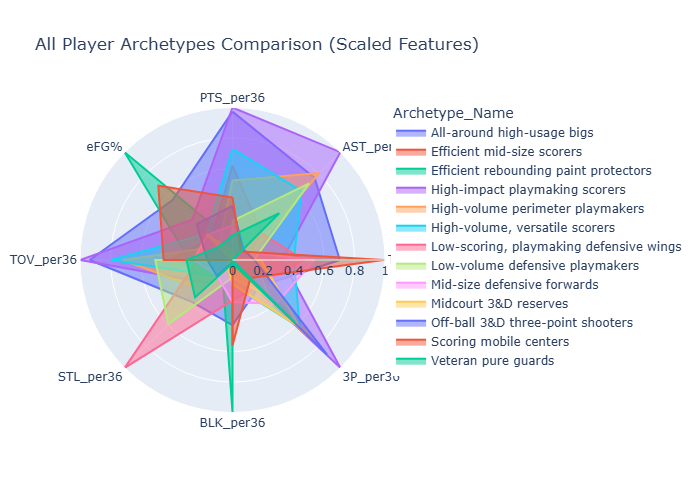

*This chart shows all 13 archetypes with different colors. Each archetype is represented as a filled polygon, making it easy to compare their statistical profiles across all metrics.*

**Chart Interpretation:**
- **Radius (r-axis):** Represents the scaled value (0-1) for each statistic
- **Angle (theta-axis):** Represents different statistical categories
- **Color coding:** Each archetype has a distinct color
- **Filled areas:** Show the complete statistical profile for each archetype

#### Individual Archetype Radar Charts

Generate detailed radar charts for each archetype to examine their specific strengths:

```python
# Generate individual radar charts for each archetype
for archetype_name in df_long_format['Archetype_Name'].unique():
    df_single_archetype = df_long_format[df_long_format['Archetype_Name'] == archetype_name]

    fig = px.line_polar(
        df_single_archetype,
        r='Scaled_Value',
        theta='Statistic',
        line_close=True,
        title=f'Archetype Profile: {archetype_name}',
        labels={'Scaled_Value': 'Scaled Value (0-1)', 'Statistic': 'Statistic'},
        height=650,
        width=750
    )

    fig.update_traces(fill='toself')

    # Customize layout for better readability
    fig.update_layout(
        polar=dict(
            radialaxis=dict(
                visible=True,
                range=[0, 1],
                tickvals=[0, 0.25, 0.5, 0.75, 1],
                ticktext=['0', '0.25', '0.5', '0.75', '1'],
                gridcolor='lightgray',
                linecolor='lightgray'
            ),
            angularaxis=dict(
                rotation=90,
                direction="clockwise",
                tickfont=dict(size=10),
                linecolor='gray',
                linewidth=0.5,
                gridcolor='lightgray'
            )
        ),
        title_font_size=16,
        title_x=0.5
    )

    fig.show()
```

**📊 Individual Archetype Radar Charts Output:**

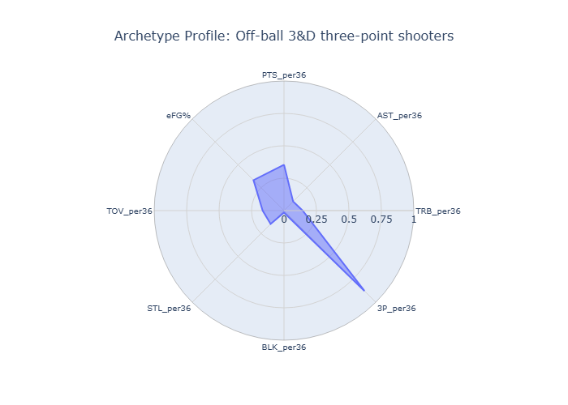

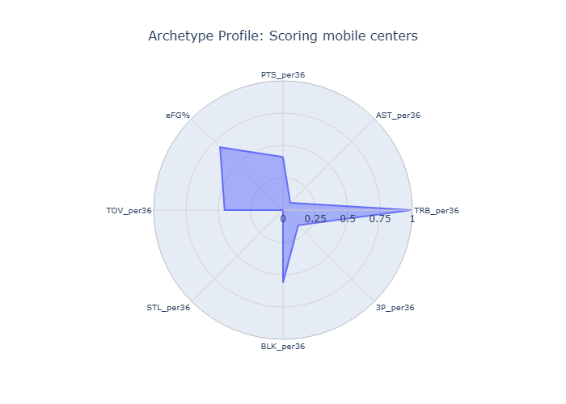

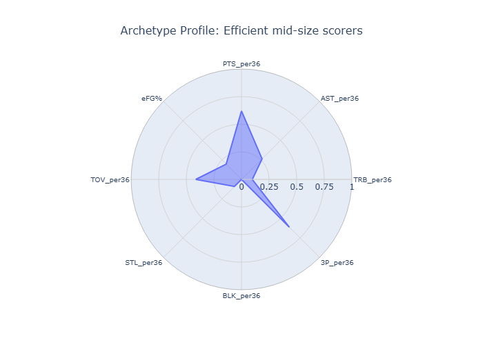

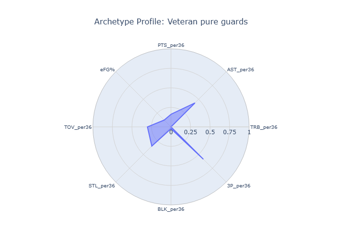

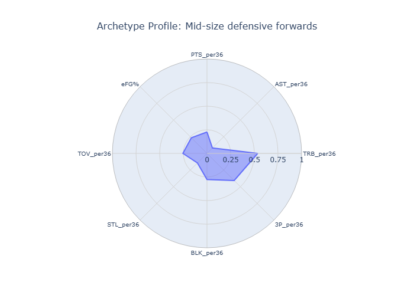

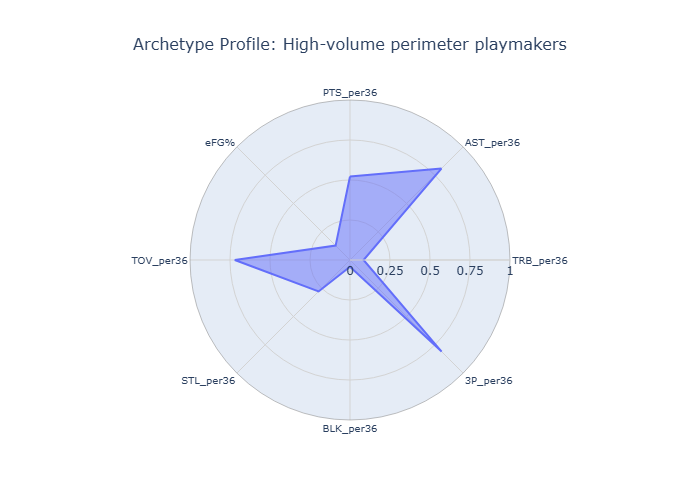

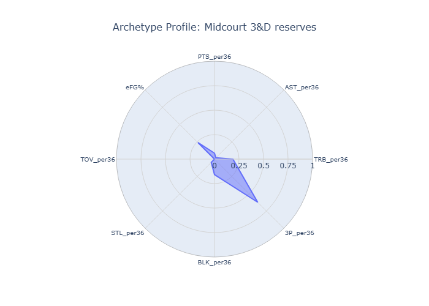

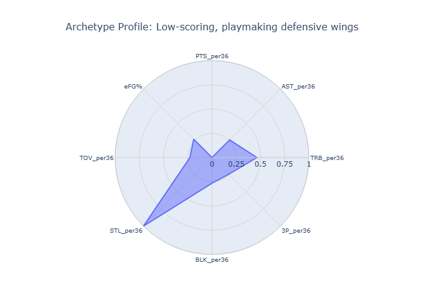

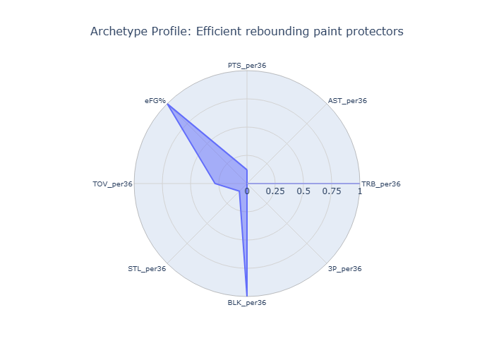

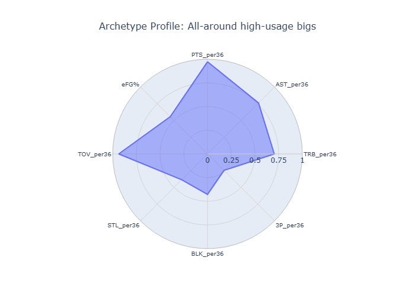

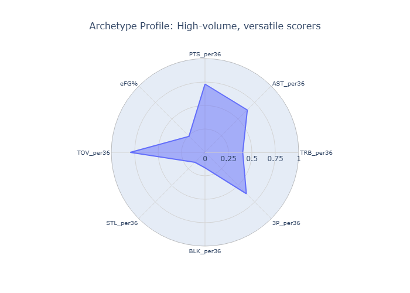

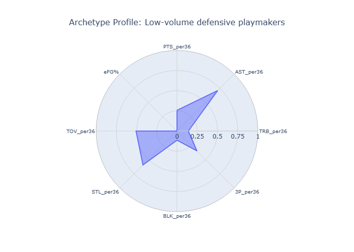

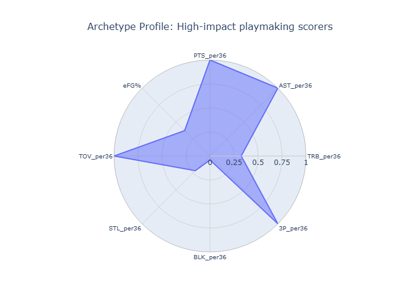

*These charts show the specific statistical profile of each archetype with a filled polygon representing their strengths and weaknesses across all metrics.*

#### Enhanced Radar Charts with Additional Features

For more detailed analysis, you can create radar charts with additional statistical categories:

```python
# Enhanced radar chart with more features
radar_features_extended = [
    'PTS_per36', 'AST_per36', 'TRB_per36', '3P_per36', 'BLK_per36',
    'STL_per36', 'TOV_per36', 'PF_per36', 'FG%', '3P%', 'eFG%', 'FT%'
]

# Filter features that exist in the dataframe
radar_features_extended = [f for f in radar_features_extended if f in cluster_means_for_plotting.columns]

scaler_radar_extended = MinMaxScaler()
scaled_radar_data_extended = scaler_radar_extended.fit_transform(cluster_means_for_plotting[radar_features_extended])
scaled_radar_df_extended = pd.DataFrame(scaled_radar_data_extended, columns=radar_features_extended, index=cluster_means_for_plotting.index)

# Transform to long format
df_long_format_extended = scaled_radar_df_extended.reset_index().melt(
    id_vars=['Archetype_Name'],
    value_vars=radar_features_extended,
    var_name='Statistic',
    value_name='Scaled_Value'
)

# Create enhanced radar charts for each archetype
for archetype_name in df_long_format_extended['Archetype_Name'].unique():
    df_single_archetype = df_long_format_extended[df_long_format_extended['Archetype_Name'] == archetype_name]

    fig = px.line_polar(
        df_single_archetype,
        r='Scaled_Value',
        theta='Statistic',
        line_close=True,
        title=f'Enhanced Archetype Profile: {archetype_name}',
        labels={'Scaled_Value': 'Scaled Value (0-1)', 'Statistic': 'Statistic'},
        height=650,
        width=750
    )

    fig.update_traces(fill='toself')

    # Enhanced layout
    fig.update_layout(
        polar=dict(
            radialaxis=dict(
                visible=True,
                range=[0, 1],
                tickvals=[0, 0.25, 0.5, 0.75, 1],
                ticktext=['0', '0.25', '0.5', '0.75', '1'],
                gridcolor='lightgray',
                linecolor='lightgray'
            ),
            angularaxis=dict(
                rotation=90,
                direction="clockwise",
                tickfont=dict(size=10),
                linecolor='gray',
                linewidth=0.5,
                gridcolor='lightgray'
            )
        ),
        title_font_size=16,
        title_x=0.5
    )

    fig.show()
```

**📊 CHART OUTPUT: Enhanced Individual Archetype Radar Charts**
*This code generates enhanced radar charts with additional statistical categories (FG%, 3P%, eFG%, FT%) for each archetype, providing a more comprehensive view of their shooting and efficiency profiles.*

#### Saving Radar Charts as Images

To save the radar charts for presentations or reports:

```python
# Install kaleido for image export if not already installed
# pip install kaleido

# Save individual archetype charts as PNG files
for archetype_name in df_long_format['Archetype_Name'].unique():
    df_single_archetype = df_long_format[df_long_format['Archetype_Name'] == archetype_name]

    fig = px.line_polar(
        df_single_archetype,
        r='Scaled_Value',
        theta='Statistic',
        line_close=True,
        title=f'Archetype Profile: {archetype_name}',
        labels={'Scaled_Value': 'Scaled Value (0-1)', 'Statistic': 'Statistic'},
        height=650,
        width=750
    )

    fig.update_traces(fill='toself')
    
    # Customize layout
    fig.update_layout(
        polar=dict(
            radialaxis=dict(
                visible=True,
                range=[0, 1],
                tickvals=[0, 0.25, 0.5, 0.75, 1],
                ticktext=['0', '0.25', '0.5', '0.75', '1'],
                gridcolor='lightgray',
                linecolor='lightgray'
            ),
            angularaxis=dict(
                rotation=90,
                direction="clockwise",
                tickfont=dict(size=10),
                linecolor='gray',
                linewidth=0.5,
                gridcolor='lightgray'
            )
        ),
        title_font_size=16,
        title_x=0.5
    )

    # Save as PNG file
    filename_safe = archetype_name.replace(' ', '_').replace('/', '_').replace('-', '_')
    fig.write_image(f"archetype_profile_{filename_safe}.png")
    print(f"Saved: archetype_profile_{filename_safe}.png")
```

**📊 Saved Radar Chart Images**
*This code will save each archetype's radar chart as a PNG file in your working directory. You'll get 13 files named like:*
- `archetype_profile_Off-ball_3D_three-point_shooters.png`
- `archetype_profile_Scoring_mobile_centers.png`
- `archetype_profile_Efficient_mid-size_scorers.png`
- *... and so on for all 13 archetypes*

**Visualization Features:**
- **Interactive charts** that can be zoomed and hovered over
- **Color-coded archetypes** for easy comparison
- **Scaled values (0-1)** for fair comparison across different statistics
- **Multiple chart types:** Combined view and individual archetype profiles
- **Export capabilities** for presentations and reports

### Generating the Radar Chart Images

The radar chart images shown above were generated using the `generate_radar_charts.py` script. To recreate these images:

```bash
# Install required dependencies
pip install plotly kaleido pandas scikit-learn

# Run the script
python generate_radar_charts.py
```

This script will:
1. Load and process your NBA data
2. Perform the clustering analysis
3. Generate individual radar charts for each archetype
4. Create a combined radar chart showing all archetypes
5. Save all charts as PNG files in an `images/` directory

**Generated Files:**
- `images/all_archetypes_comparison_radar.png` - Combined view of all 13 archetypes
- `images/archetype_[number]_[name]_radar.png` - Individual archetype profiles

The images are automatically included in this markdown file using standard markdown image syntax.

---

## Results and Outputs

### Generated Files
The analysis produces several CSV files for further inspection:

1. **`cluster_means_K13.csv`** - Average feature values for each archetype
2. **`position_distribution_K13.csv`** - Positional distribution within each cluster
3. **`all_players_with_clusters_K13.csv`** - All players with their cluster assignments
4. **`top_5_players_per_cluster_K13_all_stats.csv`** - Top 5 players per cluster with all statistics
5. **`nba_players_with_archetypes_K13_final.csv`** - Final dataset with archetype names
6. **`archetype_summary_statistics.csv`** - Summary statistics for each archetype
7. **`archetype_position_distribution.csv`** - Positional distribution across archetypes

### Key Findings

**Archetype Distribution:**
- **Mid-size defensive forwards:** 72 players (largest group)
- **Midcourt 3&D reserves:** 72 players
- **Veteran pure guards:** 69 players
- **Off-ball 3&D three-point shooters:** 62 players
- **Scoring mobile centers:** 45 players
- **High-volume perimeter playmakers:** 38 players
- **Efficient rebounding paint protectors:** 35 players
- **Low-scoring, playmaking defensive wings:** 34 players
- **Low-volume defensive playmakers:** 29 players
- **High-volume, versatile scorers:** 25 players
- **Efficient mid-size scorers:** 22 players
- **All-around high-usage bigs:** 9 players
- **High-impact playmaking scorers:** 5 players

### Applications
This archetype classification system can be used for:
- **Team Building:** Identifying complementary player types
- **Scouting:** Finding players that fit specific roles
- **Lineup Optimization:** Creating balanced lineups
- **Player Development:** Understanding player strengths and areas for improvement
- **Strategic Planning:** Informing roster construction decisions

---

## Conclusion

The NBA Archetype Analyzer successfully classified 679 NBA players into 13 distinct archetypes based on their statistical profiles. The analysis provides a comprehensive framework for understanding player roles and can inform strategic decisions in team building and lineup construction.

The clustering approach using K-means with K=13 revealed meaningful player groupings that align with basketball intuition while providing quantitative insights into player characteristics and team composition strategies. 