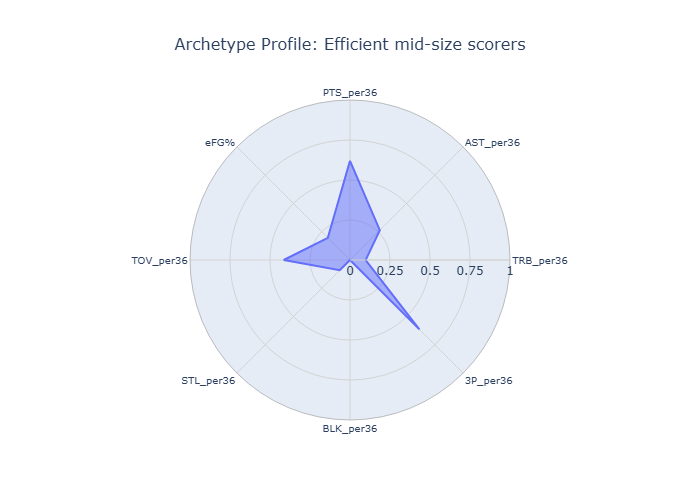
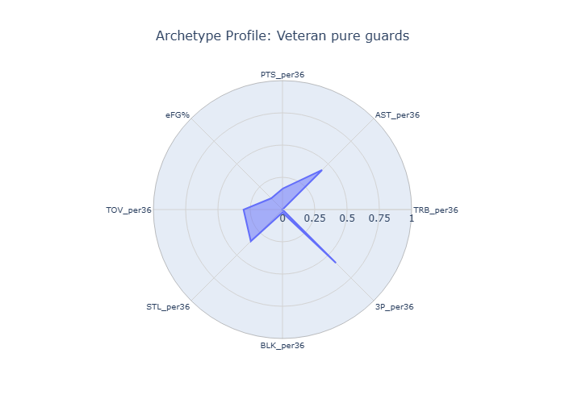
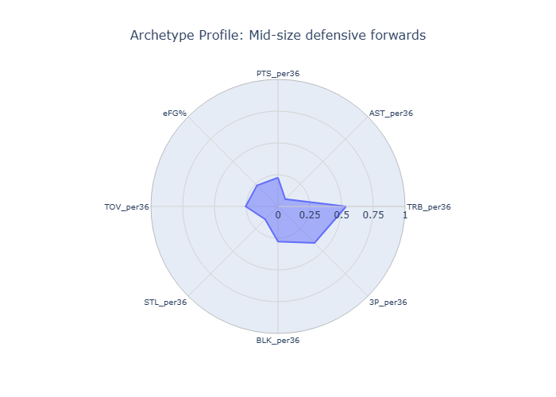
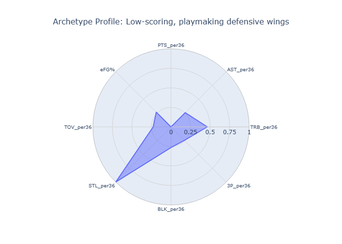
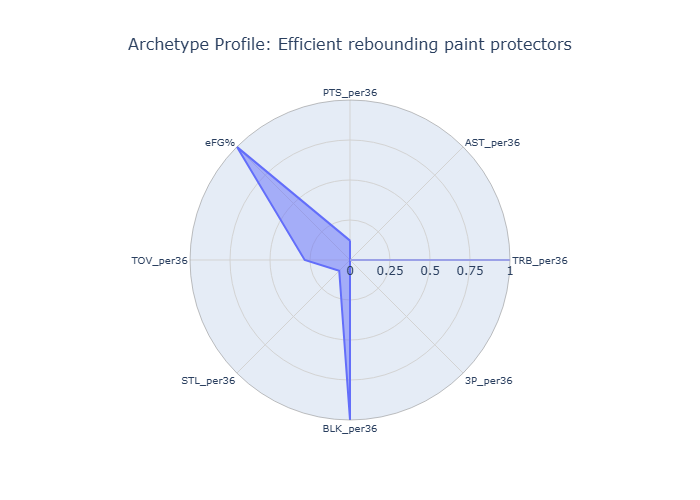
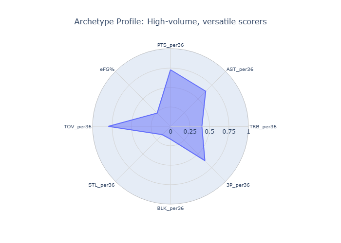
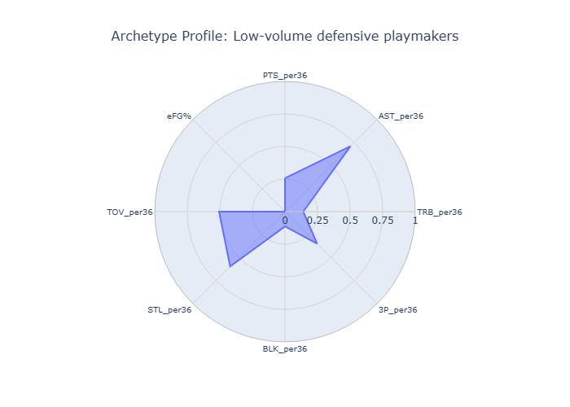
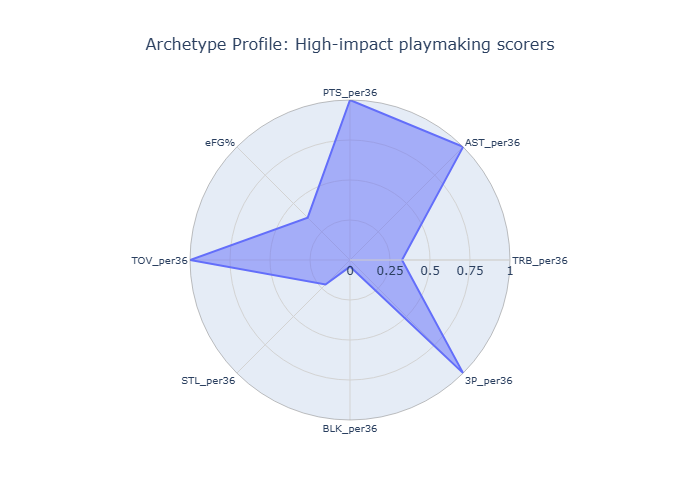

# 🏀 NBA Archetype Analyzer: Unlocking Player Roles for Strategic Lineup Building

## 🌟 Project Overview

In the fast-evolving world of NBA basketball, understanding individual player talent is crucial, but recognizing *how different players fit together* is the ultimate key to success. This project dives deep into historical NBA player statistics to identify and characterize distinct player archetypes, providing a data-driven framework for strategic lineup construction.

Forget rigid positions! This analysis focuses on **what players *do*** on the court, classifying them into roles based on their unique blend of offensive, defensive, and playmaking contributions.

## 🎯 The Goal

The primary objective of this project was to:
1.  **Extract and process** comprehensive NBA player statistics.
2.  **Apply unsupervised machine learning** (K-Means clustering) to automatically group players into distinct archetypes.
3.  **Rigorously analyze and name** these archetypes, ensuring they are interpretable and align with modern NBA roles.
4.  **Demonstrate the strategic value** of these archetypes for building balanced and complementary lineups.

## ⚙️ Methodology

Our analytical journey involved several key phases:

### 1. Data Acquisition & Preprocessing
* **Source:** We started with a rich dataset of historical NBA player statistics (e.g., from Basketball-Reference via Kaggle).
* **Cleaning:** Handled missing values, standardized data formats, and filtered out players with insufficient minutes played to ensure statistical significance.
* **Feature Engineering:** Transformed raw box score numbers into rate-based, context-independent metrics (e.g., Points per 36 Minutes, Rebounding Percentage, True Shooting Percentage, etc.). These normalized features are crucial for fair player comparison.

### 2. Archetype Clustering (K-Means)
* **Algorithm:** K-Means clustering was chosen for its interpretability and efficiency in grouping similar data points.
* **Optimal K-Value Selection:** Employed the Elbow Method and Silhouette Score to guide the selection of the optimal number of clusters. Through careful iteration and **domain-specific interpretation**, we determined that **13 distinct archetypes** provided the most insightful and actionable classifications, effectively balancing statistical separation with real-world basketball understanding.

### 3. Archetype Naming & Profiling
* Each of the 13 clusters was meticulously analyzed by examining:
    * **Average statistical profiles:** Key strengths and weaknesses across all engineered features.
    * **Positional distribution:** Which traditional positions frequently fall into a given archetype.
    * **Top sample players:** Identifying well-known players within each cluster to validate and intuitively understand the archetype.
* This iterative process allowed us to assign descriptive and meaningful names to each archetype.

## ✨ Key Insights & Player Archetypes

Our analysis revealed **13 unique and highly descriptive NBA player archetypes**, each with a distinct statistical fingerprint and role on the court. These classifications go beyond traditional positions, offering a nuanced view of player contributions.

### Visualizing the Archetype Landscape

Below is a comparison showcasing the general statistical profiles of our 13 archetypes. Each radar chart shows the scaled statistical profile (0-1) across key metrics including Points, Assists, Rebounds, 3-Point Shooting, Blocks, Steals, Turnovers, and Effective Field Goal Percentage.

* **Overall Archetype Comparison:**
    

### Diving into Individual Archetype Profiles

Here are detailed radar charts for each of the 13 archetypes, highlighting their unique blend of skills across various dimensions:

* **Off-ball 3&D Three-Point Shooters:**
     

* **Scoring Mobile Centers:**
     

* **Efficient Mid-Size Scorers:**
     

* **Veteran Pure Guards:**
     

* **Mid-size Defensive Forwards:**
     

* **High-Volume Perimeter Playmakers:**
     

* **Midcourt 3&D Reserves:**
     

* **Low-scoring, Playmaking Defensive Wings:**
     

* **Efficient Rebounding Paint Protectors:**
     

* **All-around High-Usage Bigs:**
     

* **High-volume, Versatile Scorers:**
     

* **Low-volume Defensive Playmakers:**
     

* **High-impact Playmaking Scorers:**
     
    
### The 13 Archetypes: A Detailed Look

| Cluster ID | Archetype Name                             | Defining Traits (Key Stats)                                     | Typical Positions | Example Players (from data)                   |
| :--------- | :----------------------------------------- | :-------------------------------------------------------------- | :---------------- | :-------------------------------------------- |
| 0          | **Off-ball 3&D Three-Point Shooters** | High 3PA, High 3P%, Solid defense (STL/BLK), Lower AST/TOV    | SG, SF            | Klay Thompson, Harrison Barnes                |
| 1          | **Scoring Mobile Centers** | High PTS, High TRB, Efficient FG%, Low 3PA, Good BLK          | C, PF             | Bam Adebayo, Domantas Sabonis                 |
| 2          | **Efficient Mid-size Scorers** | High PTS, High FGA, Good eFG%, Versatile FG%, Moderate AST    | SG, SF, PF        | Kyrie Irving (SG), DeMar DeRozan (SF)         |
| 3          | **Veteran Pure Guards** | High AST, Low TOV, Solid 3P%, Moderate PTS, Higher Age        | PG, SG            | Marcus Smart, Mike Conley                     |
| 4          | **Mid-size Defensive Forwards** | High STL/BLK, Strong TRB, Moderate PTS/FGA, Efficient FG%     | SF, PF            | De'Andre Hunter, Jabari Smith Jr.             |
| 5          | **High-Volume Perimeter Playmakers** | Very High AST, High PTS, High FGA, High TOV, High 3PA         | PG, SG            | James Harden, Fred VanVleet                   |
| 6          | **Midcourt 3&D Reserves** | Lower PTS/FGA (Reserves), Good 3P%, Solid defense (STL/BLK)   | SF, PF, SG        | Dorian Finney-Smith, Royce O'Neale            |
| 7          | **Low-scoring, Playmaking Defensive Wings**| High STL, Good TRB, Moderate AST, Low PTS/FGA                 | SF, PF            | Josh Hart, Draymond Green                     |
| 8          | **Efficient Rebounding Paint Protectors** | Extremely High TRB (ORB/DRB), Very High BLK, High eFG%, Low 3PA | C                 | Nic Claxton, Rudy Gobert                      |
| 9          | **All-around High-Usage Bigs** | Elite PTS, High TRB, High AST (for big), High Usage/TOV       | C, PF             | Nikola Jokić, Joel Embiid                     |
| 10         | **All-around Offensive Shooters** | High PTS/FGA, Good 3P%/eFG%, Balanced AST/TRB                 | SG, SF, PF        | Pascal Siakam, Anthony Edwards                |
| 11         | **Low-volume Defensive Playmakers** | Moderate AST, Good STL/BLK, Low PTS/FGA, Efficient           | PG, SG, SF        | Mikal Bridges, Chris Paul                     |
| 12         | **High-impact Playmaking Scorers** | Top-tier PTS, Top-tier AST, Very High Usage/TOV, High 3PA     | PG, SG, SF        | Luka Dončić, Damian Lillard, Jayson Tatum     |

## 🏀 Strategic Value & Applications

These archetypes are more than just clusters; they are a strategic lens for understanding NBA dynamics:

* **Optimized Lineup Balancing:** Instead of relying on rigid positions, teams can now construct lineups ensuring a strategic mix of archetypes (e.g., pairing a "High-impact Playmaking Scorer" with a "Off-ball 3&D Three-Point Shooter" for spacing, and an "Efficient Rebounding Paint Protector" for defense).
* **Player Scouting & Draft Strategy:** Identify specific archetype "gaps" on a roster to target in free agency or the NBA Draft.
* **Player Development:** Tailor development plans for young players to cultivate them into specific, valuable archetypes.
* **Fantasy Basketball & Betting:** Gain an edge by predicting how certain archetypes might perform in specific matchups or roles.

---

## 🛠️ Technologies Used

* **Python:** The core programming language.
* **Pandas:** For data manipulation and analysis.
* **NumPy:** For numerical operations.
* **Scikit-learn:** For K-Means clustering and data preprocessing (e.g., `StandardScaler`, `MinMaxScaler`).
* **Plotly:** For interactive and compelling data visualizations (radar charts).

